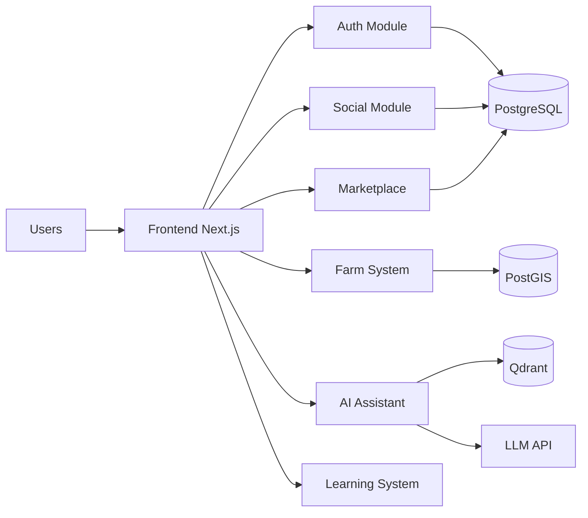
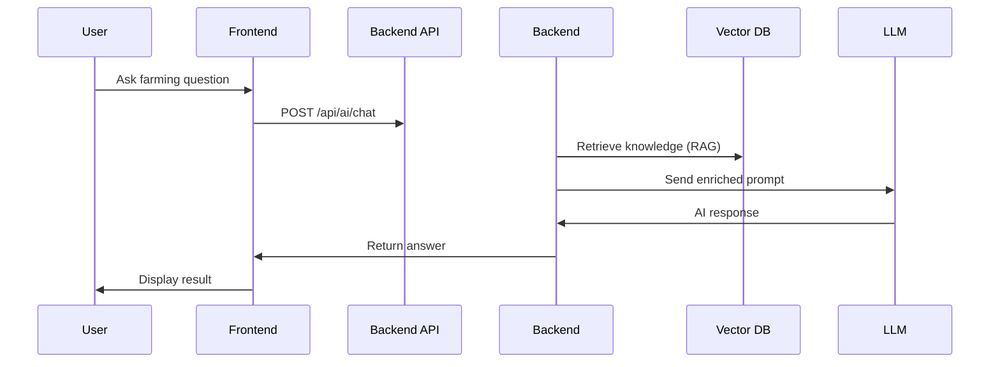
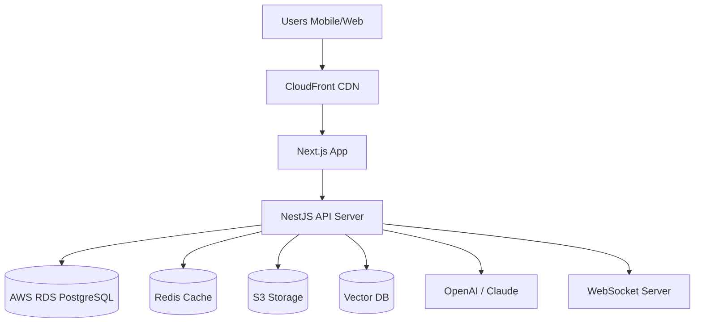
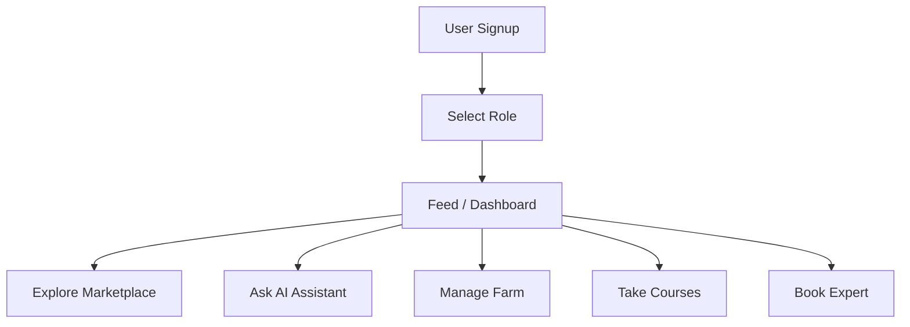

# 🌾 FARMJUMNOY – INVESTOR GRADE PRD (2026)

---

# 1. EXECUTIVE SUMMARY

FarmJumnoy is a next-generation **Agritech Super App for Cambodia** combining:

- Social network for farmers  
- AI farming assistant (RAG-based intelligence)  
- Digital marketplace for agriculture products  
- Farm management system (GIS + analytics)  
- Online learning + certification platform  
- Expert consultation ecosystem  

🎯 Goal: Digitally transform agriculture in Cambodia and Southeast Asia.

---

# 2. BUSINESS MODEL

## Revenue Streams

- 📚 Subscription (premium learning + AI tools)
- 🛒 Marketplace commission (product sales)
- 🧑‍🏫 Expert consultation fees
- 🏅 Certification services
- 🤖 AI premium assistant usage

---

# 3. SYSTEM ARCHITECTURE (HIGH LEVEL)

```mermaid
graph TD
A[Next.js Frontend (PWA)] --> B[NestJS Backend API]
B --> C[PostgreSQL + PostGIS]
B --> D[Redis Queue / Cache]
B --> E[Socket.io Realtime]
B --> F[Qdrant Vector DB (AI)]
B --> G[AI Models (OpenAI / Claude)]
B --> H[AWS S3 Storage]
B --> I[Meilisearch]
```

---

# 4. DETAILED MICROSYSTEM DESIGN



---

# 5. DATA FLOW ARCHITECTURE



---

# 6. DEPLOYMENT ARCHITECTURE



---

# 7. CORE MODULES

## Social System
- Posts, likes, comments
- Feed algorithm
- Groups & chat

## Marketplace
- Products
- Orders
- Vendor dashboard

## Farm System
- GIS farm mapping
- Crop tracking
- Finance tracking

## AI System
- Chat assistant
- Crop disease detection
- RAG knowledge engine

## Learning System
- Courses
- Quizzes
- Certificates

---

# 8. USER JOURNEY (SIMPLIFIED)



---

# 9. TECH STACK

## Frontend
- Next.js 16
- React 19
- Tailwind CSS
- Shadcn UI
- Zustand
- PWA

## Backend
- NestJS (modular monolith)
- Prisma ORM
- PostgreSQL + PostGIS
- Redis + BullMQ
- Socket.io

## AI Layer
- OpenAI / Claude / Gemini
- LangChain
- Qdrant Vector DB

## Infra
- Docker
- AWS (S3, RDS, CloudFront)

---

# 10. COMPETITIVE ADVANTAGE

- First AI-powered agritech super app in Cambodia
- Khmer language AI farming assistant
- Offline-first mobile design
- Unified ecosystem (social + market + AI)

---

# 11. SCALABILITY STRATEGY

- Modular monolith → microservices later
- Redis caching layer
- CDN global delivery
- Event-driven architecture
- Horizontal scaling API servers

---

# 12. KPI METRICS

- Active farmers per month
- Marketplace transactions
- AI queries per day
- Course completion rate
- Farm productivity improvement

---

# 13. INVESTMENT VALUE

FarmJumnoy is positioned as:

- 🌏 Regional agritech leader (SEA)
- 🤖 AI-first agriculture platform
- 💰 Multi-revenue SaaS + marketplace hybrid

---

# 14. ROADMAP

Phase 1 (MVP):
- Social + AI + basic marketplace

Phase 2:
- Farm management + learning

Phase 3:
- Scale + mobile app + AI expansion

Phase 4:
- Regional expansion + gov partnerships

---

# END OF DOCUMENT
