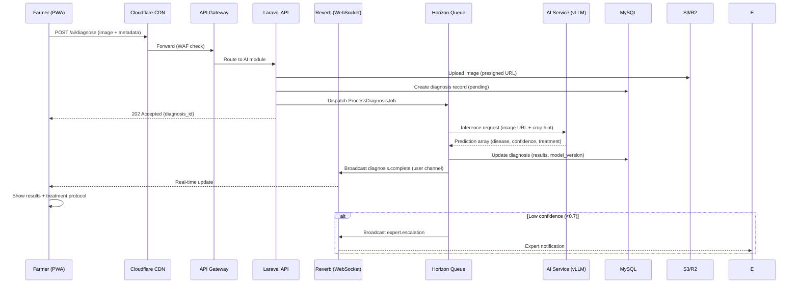
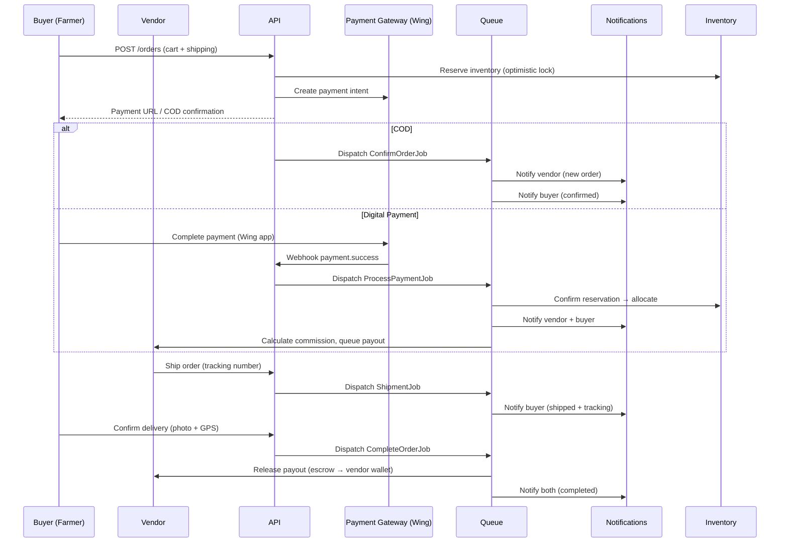

# FarmJumnoy - Phase 3: System Architecture

## 3.1 Architectural Principles

| Principle | Description | Implementation |
|-----------|-------------|----------------|
| **Modular Monolith First** | Start as single deployable unit; extract services at scale boundaries | Laravel modules; domain-driven design; clear service boundaries |
| **API-First** | All functionality exposed via versioned REST/GraphQL APIs | OpenAPI 3.1 spec; contract testing; SDK generation |
| **Event-Driven** | Async communication for decoupling, resilience, scalability | Laravel Events + Horizon; Kafka for cross-service (later) |
| **Offline-First** | Client works without network; sync on reconnect | Service Workers + IndexedDB; CRDT for conflict resolution |
| **Multi-Tenant Ready** | Coop/NGO/Gov isolation; data partitioning | Row-level security; tenant context in every request |
| **Observability Native** | Logs, metrics, traces built-in, not bolted on | OpenTelemetry SDK; structured logging; exemplar traces |
| **Security by Default** | Deny-by-default; encryption everywhere; audit all | Policies, middleware, field-level encryption, immutable audit |

---

## 3.2 High-Level Architecture

```
┌─────────────────────────────────────────────────────────────────────────────────────┐
│                                    CLIENT LAYER                                      │
├─────────────────────┬─────────────────────┬─────────────────────┬───────────────────┤
│   Next.js 16 PWA    │   React Native      │   Admin Dashboard   │   Inspector App   │
│   (Farmer/Expert/   │   (iOS/Android)     │   (Next.js + tRPC)  │   (Capacitor/     │
│    Vendor/NGO)      │   (Expert/Inspector)│   (Internal)        │    Native)        │
└─────────────────────┴─────────────────────┴─────────────────────┴───────────────────┘
                                    │
                              ┌─────▼─────┐
                              │  CLOUDFLARE │
                              │   CDN/WAF   │
                              │   + R2      │
                              └─────┬─────┘
                                    │
┌─────────────────────────────────────────────────────────────────────────────────────┐
│                                    API GATEWAY (Kong / AWS API Gateway)              │
│                         Rate Limit | Auth | Routing | Transformation                │
└─────────────────────────────────────────────────────────────────────────────────────┘
                                    │
        ┌───────────────────────────┼───────────────────────────┐
        ▼                           ▼                           ▼
┌───────────────┐           ┌───────────────┐           ┌───────────────┐
│  LARAVEL      │           │  LARAVEL      │           │  AI/ML        │
│  API CLUSTER  │           │  REVERB       │           │  SERVICE      │
│  (Octane)     │           │  CLUSTER      │           │  (vLLM/Triton)│
│               │           │  (WebSocket)  │           │               │
│ ┌───────────┐ │           │               │           │ ┌───────────┐ │
│ │ Auth      │ │           │  Channels:    │           │ │ Diagnosis │ │
│ │ Social    │ │           │  - chat       │           │ │ Advisory  │ │
│ │ Education │ │           │  - notifications          │ │ │ Yield     │ │
│ │ Market    │ │           │  - presence   │           │ │ │ Price     │ │
│ │ Cert      │ │           │  - live-updates           │ │ │ Planner   │ │
│ │ Consult   │ │           │               │           │ └───────────┘ │
│ │ Farm      │ │           │  Horizontal   │           └───────────────┘
│ └───────────┘ │           │  Scaling      │                    │
└───────────────┘           └───────────────┘                    │
        │                           │                            │
        └───────────────────────────┼────────────────────────────┘
                                    ▼
┌─────────────────────────────────────────────────────────────────────────────────────┐
│                              DATA LAYER                                              │
├──────────────┬──────────────┬──────────────┬──────────────┬──────────────┬──────────┤
│  MySQL 8     │  Redis       │  Meilisearch │  S3/R2       │  Kafka       │  Vector  │
│  (Primary)   │  Cluster     │  (Search)    │  (Objects)   │  (Events)    │  DB      │
│  InnoDB      │  (Session,   │              │  + Cloudflare│  (Future)    │  (pgvec/ │
│  Cluster     │   Cache,     │              │   Images)    │              │   Weaviate)│
│              │   Queue)     │              │              │              │          │
└──────────────┴──────────────┴──────────────┴──────────────┴──────────────┴──────────┘
```

---

## 3.3 Laravel Modular Monolith Structure

```
app/
├── Modules/
│   ├── Auth/
│   │   ├── Models/          # User, Role, Permission, Session, Device
│   │   ├── Policies/        # UserPolicy, RolePolicy
│   │   ├── Events/          # UserRegistered, LoginAttempted, PasswordReset
│   │   ├── Listeners/       # SendWelcomeEmail, TrackLoginMetrics
│   │   ├── Jobs/            # SyncUserToSearch, GenerateBackupCodes
│   │   ├── Http/Controllers/# AuthController, SessionController
│   │   ├── Requests/        # LoginRequest, RegisterRequest
│   │   ├── Resources/       # UserResource, SessionResource
│   │   ├── Routes/          # api.php, web.php
│   │   ├── Database/
│   │   │   ├── Migrations/
│   │   │   ├── Seeders/
│   │   │   └── Factories/
│   │   └── Tests/
│   │
│   ├── Social/
│   │   ├── Models/          # Post, Comment, Reaction, Follow, Group, ChatMessage
│   │   ├── Events/          # PostCreated, UserFollowed, MessageSent
│   │   ├── Jobs/            # GenerateFeed, ProcessMedia, NotifyFollowers
│   │   ├── Policies/        # PostPolicy, GroupPolicy, ChatPolicy
│   │   └── ...
│   │
│   ├── Education/
│   │   ├── Models/          # Course, Module, Lesson, Enrollment, Certificate, Quiz
│   │   ├── Events/          # CoursePublished, LessonCompleted, CertificateEarned
│   │   ├── Jobs/            # GenerateCertificate, ProcessVideo, SyncProgress
│   │   └── ...
│   │
│   ├── Marketplace/
│   │   ├── Models/          # Product, Category, Order, Cart, Review, VendorProfile
│   │   ├── Events/          # OrderPlaced, PaymentReceived, InventoryLow
│   │   ├── Jobs/            # ProcessPayment, UpdateInventory, SendOrderConfirmation
│   │   ├── Services/        # PaymentGateway, ShippingCalculator, CommissionCalculator
│   │   └── ...
│   │
│   ├── Certification/
│   │   ├── Models/          # CertificationType, Application, Inspection, Certificate
│   │   ├── Events/          # ApplicationSubmitted, InspectionCompleted, CertificateIssued
│   │   ├── Jobs/            # GenerateCertificatePDF, NotifyInspector, SyncToBlockchain
│   │   └── ...
│   │
│   ├── Consultation/
│   │   ├── Models/          # ExpertProfile, Booking, Session, Rating, Payout
│   │   ├── Events/          # BookingRequested, SessionCompleted, PayoutProcessed
│   │   └── ...
│   │
│   ├── Farm/
│   │   ├── Models/          # Farm, Plot, CropCycle, Activity, Expense, Income, Inventory
│   │   ├── Events/          # CropPlanted, ActivityLogged, HarvestRecorded
│   │   ├── Jobs/            # CalculateYield, GenerateReport, SyncSatelliteData
│   │   └── ...
│   │
│   ├── AI/
│   │   ├── Models/          # AIConversation, Diagnosis, Recommendation, Feedback
│   │   ├── Services/        # DiagnosisService, AdvisoryService, WeatherService
│   │   ├── Jobs/            # ProcessDiagnosis, RetrainModel, SyncKnowledgeBase
│   │   └── ...
│   │
│   └── Core/                # Shared: BaseModel, Traits, Enums, Exceptions, Helpers
│
├── Http/
│   ├── Middleware/          # TenantContext, AuditLog, RateLimit, Locale
│   ├── Controllers/         # Fallback, HealthCheck
│   └── Kernel.php
│
├── Console/
│   └── Kernel.php           # Scheduled commands
│
├── Providers/
│   ├── AppServiceProvider.php
│   ├── ModuleServiceProvider.php  # Auto-registers modules
│   ├── HorizonServiceProvider.php
│   ├── ReverbServiceProvider.php
│   └── TelescopeServiceProvider.php (dev)
│
└── Bootstrap/
    └── app.php
```

### Module Communication Rules

| Pattern | When to Use | Implementation |
|---------|-------------|----------------|
| **Direct (Service Injection)** | Same deployment, strong consistency, low latency | `App\Modules\Marketplace\Services\OrderService` → `App\Modules\Farm\Services\InventoryService` |
| **Events (Async)** | Decoupling, multiple consumers, eventual consistency | `OrderPlaced` → `InventoryReserved`, `CommissionCalculated`, `NotificationSent` |
| **Commands (Sync)** | Explicit intent, cross-module workflow | `ReserveInventoryCommand` dispatched from Order module |
| **API (External)** | Separate deployment, different teams, versioning | Future microservice extraction boundary |

---

## 3.4 Database Architecture

### 3.4.1 ERD Overview (Mermaid)

```mermaid
erDiagram
    USERS ||--o{ USER_ROLES : has
    USERS ||--o{ FARMS : owns
    USERS ||--o{ POSTS : creates
    USERS ||--o{ COMMENTS : writes
    USERS ||--o{ REACTIONS : gives
    USERS ||--o{ FOLLOWS : follows
    USERS ||--o{ CHAT_MESSAGES : sends
    USERS ||--o{ ENROLLMENTS : enrolls
    USERS ||--o{ CERTIFICATES : earns
    USERS ||--o{ ORDERS : places
    USERS ||--o{ REVIEWS : writes
    USERS ||--o{ BOOKINGS : books
    USERS ||--o{ AI_CONVERSATIONS : has
    USERS ||--o{ NOTIFICATIONS : receives
    USERS ||--o{ DEVICES : owns

    ROLES ||--o{ USER_ROLES : assigned
    PERMISSIONS ||--o{ ROLE_PERMISSIONS : granted

    FARMS ||--o{ PLOTS : contains
    FARMS ||--o{ FARM_MEMBERS : shares

    PLOTS ||--o{ CROP_CYCLES : grows
    PLOTS ||--o{ ACTIVITIES : records
    PLOTS ||--o{ EXPENSES : incurs
    PLOTS ||--o{ INCOMES : generates
    PLOTS ||--o{ INVENTORY_ITEMS : stores

    CROP_CYCLES ||--o{ ACTIVITIES : includes
    CROP_CYCLES ||--o{ HARVESTS : yields

    POSTS ||--o{ COMMENTS : has
    POSTS ||--o{ REACTIONS : receives
    POSTS ||--o{ POST_TAGS : tagged

    GROUPS ||--o{ GROUP_MEMBERS : includes
    GROUPS ||--o{ POSTS : contains

    CHAT_ROOMS ||--o{ CHAT_MESSAGES : contains
    CHAT_ROOMS ||--o{ CHAT_PARTICIPANTS : includes

    COURSES ||--o{ MODULES : contains
    MODULES ||--o{ LESSONS : contains
    LESSONS ||--o{ QUIZZES : assesses
    COURSES ||--o{ ENROLLMENTS : enrolls
    COURSES ||--o{ CERTIFICATES : issues

    PRODUCTS ||--o{ PRODUCT_VARIANTS : has
    PRODUCTS ||--o{ ORDERS : ordered
    PRODUCTS ||--o{ REVIEWS : reviewed
    VENDORS ||--o{ PRODUCTS : sells

    ORDERS ||--o{ ORDER_ITEMS : contains
    ORDERS ||--o{ PAYMENTS : paid
    ORDERS ||--o{ SHIPMENTS : shipped

    CERTIFICATION_TYPES ||--o{ APPLICATIONS : defines
    APPLICATIONS ||--o{ INSPECTIONS : requires
    APPLICATIONS ||--o{ CERTIFICATES : produces
    INSPECTORS ||--o{ INSPECTIONS : conducts

    EXPERT_PROFILES ||--o{ BOOKINGS : offers
    BOOKINGS ||--o{ SESSIONS : creates
    SESSIONS ||--o{ RATINGS : receives

    AI_CONVERSATIONS ||--o{ AI_MESSAGES : contains
    DIAGNOSES ||--o{ AI_CONVERSATIONS : from
```



### 3.4.2 Core Tables (MySQL 8)

#### Users & Auth

```sql
-- Users table (core identity)
CREATE TABLE users (
    id BIGINT UNSIGNED NOT NULL AUTO_INCREMENT PRIMARY KEY,
    uuid CHAR(36) NOT NULL UNIQUE DEFAULT (UUID()),
    email VARCHAR(255) UNIQUE,
    phone VARCHAR(20) UNIQUE,
    password_hash VARCHAR(255), -- nullable for social-only accounts
    first_name VARCHAR(100) NOT NULL,
    last_name VARCHAR(100) NOT NULL,
    khmer_name VARCHAR(200), -- Unicode Khmer script
    avatar_url VARCHAR(500),
    date_of_birth DATE,
    gender ENUM('male','female','other'),
    locale VARCHAR(10) DEFAULT 'km_KH', -- km_KH, en_US, vi_VN, th_TH
    timezone VARCHAR(50) DEFAULT 'Asia/Phnom_Penh',
    is_verified BOOLEAN DEFAULT FALSE,
    verification_method ENUM('email','phone','social','manual'),
    last_login_at TIMESTAMP NULL,
    login_count INT UNSIGNED DEFAULT 0,
    status ENUM('active','suspended','deleted','pending_verification') DEFAULT 'pending_verification',
    deleted_at TIMESTAMP NULL,
    created_at TIMESTAMP DEFAULT CURRENT_TIMESTAMP,
    updated_at TIMESTAMP DEFAULT CURRENT_TIMESTAMP ON UPDATE CURRENT_TIMESTAMP,
    
    INDEX idx_email (email),
    INDEX idx_phone (phone),
    INDEX idx_status (status),
    INDEX idx_locale (locale)
) ENGINE=InnoDB DEFAULT CHARSET=utf8mb4 COLLATE=utf8mb4_unicode_ci;

-- Roles (static reference data)
CREATE TABLE roles (
    id TINYINT UNSIGNED NOT NULL AUTO_INCREMENT PRIMARY KEY,
    slug VARCHAR(50) NOT NULL UNIQUE, -- farmer, expert, vendor, ngo, gov, admin, super_admin
    name_km VARCHAR(100) NOT NULL,
    name_en VARCHAR(100) NOT NULL,
    description_km TEXT,
    description_en TEXT,
    hierarchy_level TINYINT UNSIGNED DEFAULT 0, -- 0=farmer, 10=expert/vendor, 20=ngo/gov, 100=admin
    is_system BOOLEAN DEFAULT TRUE,
    created_at TIMESTAMP DEFAULT CURRENT_TIMESTAMP
) ENGINE=InnoDB DEFAULT CHARSET=utf8mb4 COLLATE=utf8mb4_unicode_ci;

-- Permissions (granular)
CREATE TABLE permissions (
    id SMALLINT UNSIGNED NOT NULL AUTO_INCREMENT PRIMARY KEY,
    slug VARCHAR(100) NOT NULL UNIQUE, -- farm.create, marketplace.sell, ai.consult
    name_km VARCHAR(100) NOT NULL,
    name_en VARCHAR(100) NOT NULL,
    module VARCHAR(50) NOT NULL, -- auth, social, education, marketplace, etc.
    created_at TIMESTAMP DEFAULT CURRENT_TIMESTAMP
) ENGINE=InnoDB DEFAULT CHARSET=utf8mb4 COLLATE=utf8mb4_unicode_ci;

-- User-Role (many-to-many with context)
CREATE TABLE user_roles (
    user_id BIGINT UNSIGNED NOT NULL,
    role_id TINYINT UNSIGNED NOT NULL,
    context_type VARCHAR(50) NULL, -- 'global', 'cooperative', 'farm'
    context_id BIGINT UNSIGNED NULL,
    granted_by BIGINT UNSIGNED NULL,
    expires_at TIMESTAMP NULL,
    created_at TIMESTAMP DEFAULT CURRENT_TIMESTAMP,
    PRIMARY KEY (user_id, role_id, context_type, context_id),
    FOREIGN KEY (user_id) REFERENCES users(id) ON DELETE CASCADE,
    FOREIGN KEY (role_id) REFERENCES roles(id) ON DELETE CASCADE,
    FOREIGN KEY (granted_by) REFERENCES users(id) ON DELETE SET NULL
) ENGINE=InnoDB DEFAULT CHARSET=utf8mb4 COLLATE=utf8mb4_unicode_ci;

-- Sessions (Sanctum-compatible + device tracking)
CREATE TABLE sessions (
    id CHAR(36) NOT NULL PRIMARY KEY,
    user_id BIGINT UNSIGNED NOT NULL,
    device_id CHAR(36),
    ip_address VARCHAR(45),
    user_agent TEXT,
    payload LONGTEXT NOT NULL,
    last_activity INT UNSIGNED NOT NULL,
    expires_at TIMESTAMP NOT NULL,
    created_at TIMESTAMP DEFAULT CURRENT_TIMESTAMP,
    FOREIGN KEY (user_id) REFERENCES users(id) ON DELETE CASCADE,
    INDEX idx_user_last_activity (user_id, last_activity),
    INDEX idx_expires (expires_at)
) ENGINE=InnoDB DEFAULT CHARSET=utf8mb4 COLLATE=utf8mb4_unicode_ci;

-- Devices (for session management, push tokens)
CREATE TABLE devices (
    id CHAR(36) NOT NULL PRIMARY KEY,
    user_id BIGINT UNSIGNED NOT NULL,
    platform ENUM('ios','android','web','pwa') NOT NULL,
    model VARCHAR(100),
    os_version VARCHAR(50),
    app_version VARCHAR(20),
    push_token VARCHAR(500), -- FCM/APNs token
    push_enabled BOOLEAN DEFAULT TRUE,
    last_seen_at TIMESTAMP DEFAULT CURRENT_TIMESTAMP,
    is_trusted BOOLEAN DEFAULT FALSE,
    revoked_at TIMESTAMP NULL,
    created_at TIMESTAMP DEFAULT CURRENT_TIMESTAMP,
    FOREIGN KEY (user_id) REFERENCES users(id) ON DELETE CASCADE,
    INDEX idx_user_platform (user_id, platform)
) ENGINE=InnoDB DEFAULT CHARSET=utf8mb4 COLLATE=utf8mb4_unicode_ci;
```

#### Farms & Plots

```sql
-- Farms (top-level entity)
CREATE TABLE farms (
    id BIGINT UNSIGNED NOT NULL AUTO_INCREMENT PRIMARY KEY,
    uuid CHAR(36) NOT NULL UNIQUE DEFAULT (UUID()),
    owner_id BIGINT UNSIGNED NOT NULL,
    name VARCHAR(200) NOT NULL,
    name_km VARCHAR(200),
    description TEXT,
    province VARCHAR(100) NOT NULL,
    district VARCHAR(100),
    commune VARCHAR(100),
    village VARCHAR(100),
    address TEXT,
    total_area_ha DECIMAL(10,4) NOT NULL,
    soil_type VARCHAR(50), -- sandy, clay, loam, etc.
    soil_ph DECIMAL(3,1),
    irrigation_type ENUM('rainfed','flood','drip','sprinkler','manual'),
    water_source ENUM('river','well','pond','canal','rain'),
    certification_status ENUM('none','pending','organic','gap','fairtrade','carbon'),
    certification_body VARCHAR(100),
    certification_expiry DATE,
    is_cooperative BOOLEAN DEFAULT FALSE,
    cooperative_id BIGINT UNSIGNED NULL,
    status ENUM('active','fallow','sold','archived') DEFAULT 'active',
    deleted_at TIMESTAMP NULL,
    created_at TIMESTAMP DEFAULT CURRENT_TIMESTAMP,
    updated_at TIMESTAMP DEFAULT CURRENT_TIMESTAMP ON UPDATE CURRENT_TIMESTAMP,
    FOREIGN KEY (owner_id) REFERENCES users(id) ON DELETE RESTRICT,
    INDEX idx_owner (owner_id),
    INDEX idx_location (province, district),
    INDEX idx_status (status)
) ENGINE=InnoDB DEFAULT CHARSET=utf8mb4 COLLATE=utf8mb4_unicode_ci;

-- Plots (geospatial sub-division)
CREATE TABLE plots (
    id BIGINT UNSIGNED NOT NULL AUTO_INCREMENT PRIMARY KEY,
    uuid CHAR(36) NOT NULL UNIQUE DEFAULT (UUID()),
    farm_id BIGINT UNSIGNED NOT NULL,
    name VARCHAR(100) NOT NULL,
    name_km VARCHAR(100),
    area_ha DECIMAL(10,4) NOT NULL,
    -- GeoJSON Polygon (MySQL 8 spatial)
    boundary GEOMETRY NOT NULL SRID 4326,
    centroid POINT NOT NULL SRID 4326,
    soil_type VARCHAR(50),
    soil_ph DECIMAL(3,1),
    elevation_m INT,
    slope_degrees DECIMAL(4,1),
    drainage ENUM('excellent','good','fair','poor'),
    status ENUM('active','fallow','preparation','archived') DEFAULT 'active',
    deleted_at TIMESTAMP NULL,
    created_at TIMESTAMP DEFAULT CURRENT_TIMESTAMP,
    updated_at TIMESTAMP DEFAULT CURRENT_TIMESTAMP ON UPDATE CURRENT_TIMESTAMP,
    FOREIGN KEY (farm_id) REFERENCES farms(id) ON DELETE CASCADE,
    SPATIAL INDEX idx_boundary (boundary),
    SPATIAL INDEX idx_centroid (centroid),
    INDEX idx_farm_status (farm_id, status)
) ENGINE=InnoDB DEFAULT CHARSET=utf8mb4 COLLATE=utf8mb4_unicode_ci;

-- Farm Members (cooperative sharing)
CREATE TABLE farm_members (
    farm_id BIGINT UNSIGNED NOT NULL,
    user_id BIGINT UNSIGNED NOT NULL,
    role ENUM('owner','manager','worker','viewer') DEFAULT 'viewer',
    permissions JSON, -- granular: {"activities":true,"expenses":false}
    joined_at TIMESTAMP DEFAULT CURRENT_TIMESTAMP,
    invited_by BIGINT UNSIGNED,
    PRIMARY KEY (farm_id, user_id),
    FOREIGN KEY (farm_id) REFERENCES farms(id) ON DELETE CASCADE,
    FOREIGN KEY (user_id) REFERENCES users(id) ON DELETE CASCADE,
    FOREIGN KEY (invited_by) REFERENCES users(id) ON DELETE SET NULL
) ENGINE=InnoDB DEFAULT CHARSET=utf8mb4 COLLATE=utf8mb4_unicode_ci;
```

#### Crop Cycles & Activities

```sql
-- Crop reference data (managed by admin/experts)
CREATE TABLE crop_varieties (
    id INT UNSIGNED NOT NULL AUTO_INCREMENT PRIMARY KEY,
    crop_name VARCHAR(100) NOT NULL, -- rice, maize, cassava, yardlong_bean
    crop_name_km VARCHAR(100) NOT NULL,
    variety_name VARCHAR(100) NOT NULL,
    variety_name_km VARCHAR(100),
    scientific_name VARCHAR(200),
    category ENUM('cereal','vegetable','fruit','legume','root','fiber','spice','other'),
    growing_days_min SMALLINT UNSIGNED,
    growing_days_max SMALLINT UNSIGNED,
    optimal_temp_min DECIMAL(4,1),
    optimal_temp_max DECIMAL(4,1),
    optimal_ph_min DECIMAL(3,1),
    optimal_ph_max DECIMAL(3,1),
    water_requirement ENUM('low','medium','high'),
    spacing_cm_x SMALLINT,
    spacing_cm_y SMALLINT,
    seed_rate_kg_per_ha DECIMAL(8,2),
    yield_potential_t_per_ha DECIMAL(6,2),
    common_diseases JSON, -- [{"name":"blast","name_km":"រុក","severity":"high"}]
    common_pests JSON,
    created_at TIMESTAMP DEFAULT CURRENT_TIMESTAMP,
    updated_at TIMESTAMP DEFAULT CURRENT_TIMESTAMP ON UPDATE CURRENT_TIMESTAMP,
    UNIQUE KEY uk_crop_variety (crop_name, variety_name),
    INDEX idx_category (category)
) ENGINE=InnoDB DEFAULT CHARSET=utf8mb4 COLLATE=utf8mb4_unicode_ci;

-- Crop Cycles (actual planting instances)
CREATE TABLE crop_cycles (
    id BIGINT UNSIGNED NOT NULL AUTO_INCREMENT PRIMARY KEY,
    uuid CHAR(36) NOT NULL UNIQUE DEFAULT (UUID()),
    plot_id BIGINT UNSIGNED NOT NULL,
    crop_variety_id INT UNSIGNED NOT NULL,
    season VARCHAR(20), -- 'wet_2024', 'dry_2025'
    status ENUM('planned','planted','growing','flowering','harvesting','harvested','failed','archived') DEFAULT 'planned',
    planted_at DATE,
    expected_harvest_date DATE,
    actual_harvest_date DATE,
    planting_method ENUM('direct_seed','transplant','broadcast'),
    plant_population_per_ha INT,
    target_yield_t_per_ha DECIMAL(6,2),
    actual_yield_t_per_ha DECIMAL(6,2),
    yield_quality_grade ENUM('A','B','C','reject'),
    failure_reason VARCHAR(200),
    notes TEXT,
    deleted_at TIMESTAMP NULL,
    created_at TIMESTAMP DEFAULT CURRENT_TIMESTAMP,
    updated_at TIMESTAMP DEFAULT CURRENT_TIMESTAMP ON UPDATE CURRENT_TIMESTAMP,
    FOREIGN KEY (plot_id) REFERENCES plots(id) ON DELETE CASCADE,
    FOREIGN KEY (crop_variety_id) REFERENCES crop_varieties(id) ON DELETE RESTRICT,
    INDEX idx_plot_status (plot_id, status),
    INDEX idx_season (season),
    INDEX idx_dates (planted_at, expected_harvest_date)
) ENGINE=InnoDB DEFAULT CHARSET=utf8mb4 COLLATE=utf8mb4_unicode_ci;

-- Activities (every action on a crop cycle)
CREATE TABLE activities (
    id BIGINT UNSIGNED NOT NULL AUTO_INCREMENT PRIMARY KEY,
    uuid CHAR(36) NOT NULL UNIQUE DEFAULT (UUID()),
    crop_cycle_id BIGINT UNSIGNED NOT NULL,
    user_id BIGINT UNSIGNED NOT NULL, -- who performed
    type ENUM(
        'land_prep','planting','fertilizing','pesticide','herbicide','fungicide',
        'irrigation','weeding','pruning','thinning','monitoring','harvesting',
        'post_harvest','soil_test','tissue_test','other'
    ) NOT NULL,
    type_detail VARCHAR(200), -- e.g., "NPK 15-15-15", "Chlorpyrifos 50EC"
    quantity DECIMAL(10,3),
    unit VARCHAR(20), -- kg, liter, ml, bag, hour
    cost_per_unit DECIMAL(12,2),
    total_cost DECIMAL(12,2) GENERATED ALWAYS AS (quantity * cost_per_unit) STORED,
    currency ENUM('KHR','USD') DEFAULT 'KHR',
    performed_at DATETIME NOT NULL,
    weather_condition VARCHAR(50), -- sunny, cloudy, rainy
    temperature_c DECIMAL(4,1),
    humidity_pct TINYINT UNSIGNED,
    gps_latitude DECIMAL(10,8),
    gps_longitude DECIMAL(11,8),
    photos JSON, -- [{"url":"...","caption":"..."}]
    voice_note_url VARCHAR(500),
    ai_generated BOOLEAN DEFAULT FALSE,
    notes TEXT,
    deleted_at TIMESTAMP NULL,
    created_at TIMESTAMP DEFAULT CURRENT_TIMESTAMP,
    updated_at TIMESTAMP DEFAULT CURRENT_TIMESTAMP ON UPDATE CURRENT_TIMESTAMP,
    FOREIGN KEY (crop_cycle_id) REFERENCES crop_cycles(id) ON DELETE CASCADE,
    FOREIGN KEY (user_id) REFERENCES users(id) ON DELETE RESTRICT,
    INDEX idx_cycle_performed (crop_cycle_id, performed_at),
    INDEX idx_type_date (type, performed_at),
    INDEX idx_user_date (user_id, performed_at)
) ENGINE=InnoDB DEFAULT CHARSET=utf8mb4 COLLATE=utf8mb4_unicode_ci;
```

#### Social (Posts, Chat, Groups)

```sql
-- Posts
CREATE TABLE posts (
    id BIGINT UNSIGNED NOT NULL AUTO_INCREMENT PRIMARY KEY,
    uuid CHAR(36) NOT NULL UNIQUE DEFAULT (UUID()),
    author_id BIGINT UNSIGNED NOT NULL,
    group_id BIGINT UNSIGNED NULL,
    crop_cycle_id BIGINT UNSIGNED NULL, -- link to farm activity
    content TEXT NOT NULL,
    content_km TEXT, -- Khmer translation
    language VARCHAR(10) DEFAULT 'km', -- km, en
    visibility ENUM('public','followers','group','private') DEFAULT 'public',
    media JSON, -- [{"type":"image","url":"...","width":1024,"height":768},{"type":"video","url":"...","duration":45}]
    tags JSON, -- ["#rice", "#organic", "#kampong_cham"]
    location_name VARCHAR(200),
    location_point POINT SRID 4326,
    is_pinned BOOLEAN DEFAULT FALSE,
    is_featured BOOLEAN DEFAULT FALSE,
    view_count BIGINT UNSIGNED DEFAULT 0,
    comment_count INT UNSIGNED DEFAULT 0,
    reaction_count INT UNSIGNED DEFAULT 0,
    share_count INT UNSIGNED DEFAULT 0,
    status ENUM('published','draft','archived','moderated','deleted') DEFAULT 'published',
    moderated_at TIMESTAMP NULL,
    moderated_by BIGINT UNSIGNED NULL,
    deleted_at TIMESTAMP NULL,
    created_at TIMESTAMP DEFAULT CURRENT_TIMESTAMP,
    updated_at TIMESTAMP DEFAULT CURRENT_TIMESTAMP ON UPDATE CURRENT_TIMESTAMP,
    FOREIGN KEY (author_id) REFERENCES users(id) ON DELETE CASCADE,
    FOREIGN KEY (group_id) REFERENCES groups(id) ON DELETE SET NULL,
    FOREIGN KEY (crop_cycle_id) REFERENCES crop_cycles(id) ON DELETE SET NULL,
    FOREIGN KEY (moderated_by) REFERENCES users(id) ON DELETE SET NULL,
    INDEX idx_author_created (author_id, created_at),
    INDEX idx_group_created (group_id, created_at),
    INDEX idx_visibility_status (visibility, status),
    INDEX idx_tags (tags),
    SPATIAL INDEX idx_location (location_point)
) ENGINE=InnoDB DEFAULT CHARSET=utf8mb4 COLLATE=utf8mb4_unicode_ci;

-- Reactions (4 types: like, celebrate, learn, question)
CREATE TABLE reactions (
    id BIGINT UNSIGNED NOT NULL AUTO_INCREMENT PRIMARY KEY,
    user_id BIGINT UNSIGNED NOT NULL,
    reactable_type VARCHAR(50) NOT NULL, -- 'post', 'comment', 'chat_message'
    reactable_id BIGINT UNSIGNED NOT NULL,
    reaction_type ENUM('like','celebrate','learn','question') NOT NULL,
    created_at TIMESTAMP DEFAULT CURRENT_TIMESTAMP,
    UNIQUE KEY uk_user_reactable (user_id, reactable_type, reactable_id),
    FOREIGN KEY (user_id) REFERENCES users(id) ON DELETE CASCADE,
    INDEX idx_reactable (reactable_type, reactable_id)
) ENGINE=InnoDB DEFAULT CHARSET=utf8mb4 COLLATE=utf8mb4_unicode_ci;

-- Follows
CREATE TABLE follows (
    follower_id BIGINT UNSIGNED NOT NULL,
    followable_type VARCHAR(50) NOT NULL, -- 'user', 'expert', 'vendor', 'group'
    followable_id BIGINT UNSIGNED NOT NULL,
    notify BOOLEAN DEFAULT TRUE,
    created_at TIMESTAMP DEFAULT CURRENT_TIMESTAMP,
    PRIMARY KEY (follower_id, followable_type, followable_id),
    FOREIGN KEY (follower_id) REFERENCES users(id) ON DELETE CASCADE,
    INDEX idx_followable (followable_type, followable_id)
) ENGINE=InnoDB DEFAULT CHARSET=utf8mb4 COLLATE=utf8mb4_unicode_ci;

-- Chat (1:1 and group)
CREATE TABLE chat_rooms (
    id BIGINT UNSIGNED NOT NULL AUTO_INCREMENT PRIMARY KEY,
    uuid CHAR(36) NOT NULL UNIQUE DEFAULT (UUID()),
    type ENUM('direct','group','support','consultation') NOT NULL,
    name VARCHAR(200), -- for group/support
    avatar_url VARCHAR(500),
    created_by BIGINT UNSIGNED,
    is_encrypted BOOLEAN DEFAULT FALSE, -- E2E encryption
    last_message_at TIMESTAMP NULL,
    last_message_preview VARCHAR(500),
    status ENUM('active','archived','deleted') DEFAULT 'active',
    deleted_at TIMESTAMP NULL,
    created_at TIMESTAMP DEFAULT CURRENT_TIMESTAMP,
    updated_at TIMESTAMP DEFAULT CURRENT_TIMESTAMP ON UPDATE CURRENT_TIMESTAMP,
    FOREIGN KEY (created_by) REFERENCES users(id) ON DELETE SET NULL,
    INDEX idx_type_status (type, status),
    INDEX idx_last_message (last_message_at)
) ENGINE=InnoDB DEFAULT CHARSET=utf8mb4 COLLATE=utf8mb4_unicode_ci;

CREATE TABLE chat_participants (
    chat_room_id BIGINT UNSIGNED NOT NULL,
    user_id BIGINT UNSIGNED NOT NULL,
    role ENUM('member','admin','owner') DEFAULT 'member',
    joined_at TIMESTAMP DEFAULT CURRENT_TIMESTAMP,
    left_at TIMESTAMP NULL,
    muted_until TIMESTAMP NULL,
    last_read_at TIMESTAMP NULL,
    PRIMARY KEY (chat_room_id, user_id),
    FOREIGN KEY (chat_room_id) REFERENCES chat_rooms(id) ON DELETE CASCADE,
    FOREIGN KEY (user_id) REFERENCES users(id) ON DELETE CASCADE
) ENGINE=InnoDB DEFAULT CHARSET=utf8mb4 COLLATE=utf8mb4_unicode_ci;

CREATE TABLE chat_messages (
    id BIGINT UNSIGNED NOT NULL AUTO_INCREMENT PRIMARY KEY,
    uuid CHAR(36) NOT NULL UNIQUE DEFAULT (UUID()),
    chat_room_id BIGINT UNSIGNED NOT NULL,
    sender_id BIGINT UNSIGNED NOT NULL,
    reply_to_id BIGINT UNSIGNED NULL,
    type ENUM('text','voice','image','video','file','location','contact','system') DEFAULT 'text',
    content TEXT, -- encrypted if E2E
    content_km TEXT,
    media JSON, -- for image/video/file: {url, size, mime, duration, thumbnail}
    location JSON, -- {lat, lng, name, address}
    contact JSON, -- {user_id, name, phone}
    is_edited BOOLEAN DEFAULT FALSE,
    edited_at TIMESTAMP NULL,
    deleted_at TIMESTAMP NULL,
    created_at TIMESTAMP DEFAULT CURRENT_TIMESTAMP,
    FOREIGN KEY (chat_room_id) REFERENCES chat_rooms(id) ON DELETE CASCADE,
    FOREIGN KEY (sender_id) REFERENCES users(id) ON DELETE CASCADE,
    FOREIGN KEY (reply_to_id) REFERENCES chat_messages(id) ON DELETE SET NULL,
    INDEX idx_room_created (chat_room_id, created_at),
    INDEX idx_sender (sender_id)
) ENGINE=InnoDB DEFAULT CHARSET=utf8mb4 COLLATE=utf8mb4_unicode_ci;
```

#### Marketplace

```sql
-- Product Categories (hierarchical)
CREATE TABLE categories (
    id INT UNSIGNED NOT NULL AUTO_INCREMENT PRIMARY KEY,
    parent_id INT UNSIGNED NULL,
    slug VARCHAR(100) NOT NULL UNIQUE,
    name_km VARCHAR(100) NOT NULL,
    name_en VARCHAR(100) NOT NULL,
    description_km TEXT,
    description_en TEXT,
    icon VARCHAR(100), -- Lucide icon name
    image_url VARCHAR(500),
    sort_order INT DEFAULT 0,
    is_active BOOLEAN DEFAULT TRUE,
    requires_expert_verification BOOLEAN DEFAULT FALSE, -- for seeds, pesticides
    created_at TIMESTAMP DEFAULT CURRENT_TIMESTAMP,
    updated_at TIMESTAMP DEFAULT CURRENT_TIMESTAMP ON UPDATE CURRENT_TIMESTAMP,
    FOREIGN KEY (parent_id) REFERENCES categories(id) ON DELETE SET NULL,
    INDEX idx_parent (parent_id),
    INDEX idx_active (is_active)
) ENGINE=InnoDB DEFAULT CHARSET=utf8mb4 COLLATE=utf8mb4_unicode_ci;

-- Products
CREATE TABLE products (
    id BIGINT UNSIGNED NOT NULL AUTO_INCREMENT PRIMARY KEY,
    uuid CHAR(36) NOT NULL UNIQUE DEFAULT (UUID()),
    vendor_id BIGINT UNSIGNED NOT NULL,
    category_id INT UNSIGNED NOT NULL,
    name VARCHAR(200) NOT NULL,
    name_km VARCHAR(200) NOT NULL,
    description TEXT,
    description_km TEXT,
    brand VARCHAR(100),
    model VARCHAR(100),
    sku VARCHAR(100), -- vendor's SKU
    barcode VARCHAR(50), -- EAN/UPC
    unit VARCHAR(20) NOT NULL, -- kg, bag, liter, piece, meter
    base_price DECIMAL(12,2) NOT NULL,
    currency ENUM('KHR','USD') DEFAULT 'KHR',
    sale_price DECIMAL(12,2) NULL,
    sale_starts_at TIMESTAMP NULL,
    sale_ends_at TIMESTAMP NULL,
    min_order_qty INT UNSIGNED DEFAULT 1,
    max_order_qty INT UNSIGNED NULL,
    weight_kg DECIMAL(8,3),
    dimensions_cm JSON, -- {length, width, height}
    specifications JSON, -- key-value specs
    certifications JSON, -- ["organic", "gap", "iso"]
    applicable_crops JSON, -- crop_variety_ids this product is for
    tags JSON,
    status ENUM('draft','pending_review','active','out_of_stock','discontinued','rejected') DEFAULT 'draft',
    rejection_reason TEXT,
    expert_verified BOOLEAN DEFAULT FALSE,
    verified_by BIGINT UNSIGNED NULL,
    verified_at TIMESTAMP NULL,
    view_count BIGINT UNSIGNED DEFAULT 0,
    order_count BIGINT UNSIGNED DEFAULT 0,
    rating_avg DECIMAL(3,2) DEFAULT 0,
    rating_count INT UNSIGNED DEFAULT 0,
    deleted_at TIMESTAMP NULL,
    created_at TIMESTAMP DEFAULT CURRENT_TIMESTAMP,
    updated_at TIMESTAMP DEFAULT CURRENT_TIMESTAMP ON UPDATE CURRENT_TIMESTAMP,
    FOREIGN KEY (vendor_id) REFERENCES users(id) ON DELETE CASCADE,
    FOREIGN KEY (category_id) REFERENCES categories(id) ON DELETE RESTRICT,
    FOREIGN KEY (verified_by) REFERENCES users(id) ON DELETE SET NULL,
    INDEX idx_vendor_status (vendor_id, status),
    INDEX idx_category_status (category_id, status),
    INDEX idx_price (base_price),
    INDEX idx_rating (rating_avg),
    FULLTEXT INDEX ft_name_desc (name, name_km, description, description_km)
) ENGINE=InnoDB DEFAULT CHARSET=utf8mb4 COLLATE=utf8mb4_unicode_ci;

-- Product Variants (size, color, packaging)
CREATE TABLE product_variants (
    id BIGINT UNSIGNED NOT NULL AUTO_INCREMENT PRIMARY KEY,
    product_id BIGINT UNSIGNED NOT NULL,
    name VARCHAR(100) NOT NULL,
    name_km VARCHAR(100),
    sku VARCHAR(100),
    barcode VARCHAR(50),
    price_adjustment DECIMAL(12,2) DEFAULT 0, -- + or - from base
    weight_kg DECIMAL(8,3),
    stock_qty INT UNSIGNED DEFAULT 0,
    low_stock_threshold INT UNSIGNED DEFAULT 10,
    is_default BOOLEAN DEFAULT FALSE,
    status ENUM('active','inactive') DEFAULT 'active',
    created_at TIMESTAMP DEFAULT CURRENT_TIMESTAMP,
    updated_at TIMESTAMP DEFAULT CURRENT_TIMESTAMP ON UPDATE CURRENT_TIMESTAMP,
    FOREIGN KEY (product_id) REFERENCES products(id) ON DELETE CASCADE,
    UNIQUE KEY uk_product_sku (product_id, sku),
    INDEX idx_product_default (product_id, is_default)
) ENGINE=InnoDB DEFAULT CHARSET=utf8mb4 COLLATE=utf8mb4_unicode_ci;

-- Vendor Profiles (extends users)
CREATE TABLE vendor_profiles (
    user_id BIGINT UNSIGNED NOT NULL PRIMARY KEY,
    business_name VARCHAR(200) NOT NULL,
    business_name_km VARCHAR(200),
    registration_number VARCHAR(100),
    tax_id VARCHAR(50),
    address TEXT,
    province VARCHAR(100),
    district VARCHAR(100),
    commune VARCHAR(100),
    description TEXT,
    description_km TEXT,
    logo_url VARCHAR(500),
    cover_url VARCHAR(500),
    bank_account JSON, -- {bank, account_name, account_number, branch}
    payment_gateways JSON, -- ["wing", "truemoney", "aba", "cod"]
    commission_rate DECIMAL(5,2) DEFAULT 10.00, -- percentage
    payout_schedule ENUM('daily','weekly','monthly') DEFAULT 'weekly',
    min_payout_amount DECIMAL(12,2) DEFAULT 50000, -- 50,000 KHR
    is_verified BOOLEAN DEFAULT FALSE,
    verified_at TIMESTAMP NULL,
    status ENUM('pending','active','suspended','rejected') DEFAULT 'pending',
    created_at TIMESTAMP DEFAULT CURRENT_TIMESTAMP,
    updated_at TIMESTAMP DEFAULT CURRENT_TIMESTAMP ON UPDATE CURRENT_TIMESTAMP,
    FOREIGN KEY (user_id) REFERENCES users(id) ON DELETE CASCADE,
    INDEX idx_status (status),
    INDEX idx_province (province)
) ENGINE=InnoDB DEFAULT CHARSET=utf8mb4 COLLATE=utf8mb4_unicode_ci;

-- Orders
CREATE TABLE orders (
    id BIGINT UNSIGNED NOT NULL AUTO_INCREMENT PRIMARY KEY,
    uuid CHAR(36) NOT NULL UNIQUE DEFAULT (UUID()),
    order_number VARCHAR(20) NOT NULL UNIQUE, -- FJ-20250611-000123
    buyer_id BIGINT UNSIGNED NOT NULL,
    status ENUM('pending','confirmed','processing','shipped','delivered','completed','cancelled','refunded','disputed') DEFAULT 'pending',
    subtotal DECIMAL(12,2) NOT NULL,
    shipping_fee DECIMAL(12,2) DEFAULT 0,
    discount_amount DECIMAL(12,2) DEFAULT 0,
    tax_amount DECIMAL(12,2) DEFAULT 0,
    total_amount DECIMAL(12,2) NOT NULL,
    currency ENUM('KHR','USD') DEFAULT 'KHR',
    payment_method ENUM('cod','wing','truemoney','aba','card','installment') NOT NULL,
    payment_status ENUM('pending','paid','failed','refunded','partial') DEFAULT 'pending',
    payment_reference VARCHAR(100),
    paid_at TIMESTAMP NULL,
    shipping_address JSON NOT NULL, -- {name, phone, address, province, district, commune, lat, lng}
    shipping_method VARCHAR(50), -- 'vendor_delivery', 'courier', 'pickup'
    tracking_number VARCHAR(100),
    shipped_at TIMESTAMP NULL,
    delivered_at TIMESTAMP NULL,
    completed_at TIMESTAMP NULL,
    cancelled_at TIMESTAMP NULL,
    cancellation_reason VARCHAR(200),
    notes TEXT,
    deleted_at TIMESTAMP NULL,
    created_at TIMESTAMP DEFAULT CURRENT_TIMESTAMP,
    updated_at TIMESTAMP DEFAULT CURRENT_TIMESTAMP ON UPDATE CURRENT_TIMESTAMP,
    FOREIGN KEY (buyer_id) REFERENCES users(id) ON DELETE RESTRICT,
    INDEX idx_buyer_status (buyer_id, status),
    INDEX idx_status_created (status, created_at),
    INDEX idx_payment (payment_status, payment_method)
) ENGINE=InnoDB DEFAULT CHARSET=utf8mb4 COLLATE=utf8mb4_unicode_ci;

CREATE TABLE order_items (
    id BIGINT UNSIGNED NOT NULL AUTO_INCREMENT PRIMARY KEY,
    order_id BIGINT UNSIGNED NOT NULL,
    product_id BIGINT UNSIGNED NOT NULL,
    variant_id BIGINT UNSIGNED NULL,
    vendor_id BIGINT UNSIGNED NOT NULL, -- denormalized for vendor queries
    product_name VARCHAR(200) NOT NULL, -- snapshot
    variant_name VARCHAR(100),
    unit VARCHAR(20) NOT NULL,
    quantity INT UNSIGNED NOT NULL,
    unit_price DECIMAL(12,2) NOT NULL,
    total_price DECIMAL(12,2) NOT NULL,
    commission_rate DECIMAL(5,2) NOT NULL,
    commission_amount DECIMAL(12,2) NOT NULL,
    status ENUM('pending','confirmed','shipped','delivered','returned','cancelled') DEFAULT 'pending',
    created_at TIMESTAMP DEFAULT CURRENT_TIMESTAMP,
    updated_at TIMESTAMP DEFAULT CURRENT_TIMESTAMP ON UPDATE CURRENT_TIMESTAMP,
    FOREIGN KEY (order_id) REFERENCES orders(id) ON DELETE CASCADE,
    FOREIGN KEY (product_id) REFERENCES products(id) ON DELETE RESTRICT,
    FOREIGN KEY (variant_id) REFERENCES product_variants(id) ON DELETE SET NULL,
    FOREIGN KEY (vendor_id) REFERENCES users(id) ON DELETE RESTRICT,
    INDEX idx_order (order_id),
    INDEX idx_vendor_status (vendor_id, status)
) ENGINE=InnoDB DEFAULT CHARSET=utf8mb4 COLLATE=utf8mb4_unicode_ci;
```

---

## 3.5 API Architecture

### 3.5.1 REST API Design (OpenAPI 3.1)

```yaml
openapi: 3.1.0
info:
  title: FarmJumnoy API
  version: 1.0.0
  description: |
    Unified API for FarmJumnoy Agritech Platform.
    All endpoints require authentication via Bearer token (Sanctum).
    Khmer-first: Accept-Language header defaults to km-KH.
  contact:
    name: FarmJumnoy API Team
    email: api@farmjumnoy.com
  license:
    name: Proprietary
servers:
  - url: https://api.farmjumnoy.com/v1
    description: Production
  - url: https://staging-api.farmjumnoy.com/v1
    description: Staging
  - url: http://localhost:8000/api/v1
    description: Development

security:
  - BearerAuth: []

components:
  securitySchemes:
    BearerAuth:
      type: http
      scheme: bearer
      bearerFormat: JWT
    ApiKeyAuth:
      type: apiKey
      in: header
      name: X-API-Key

  parameters:
    AcceptLanguage:
      name: Accept-Language
      in: header
      schema:
        type: string
        enum: [km-KH, en-US, vi-VN, th-TH, lo-LA, my-MM]
        default: km-KH
      description: Response language. Khmer (km-KH) is default.
    XRequestId:
      name: X-Request-ID
      in: header
      schema:
        type: string
        format: uuid
      description: Client-generated request ID for tracing
    Pagination:
      name: page
      in: query
      schema:
        type: integer
        minimum: 1
        default: 1
      description: Page number
    PerPage:
      name: per_page
      in: query
      schema:
        type: integer
        minimum: 1
        maximum: 100
        default: 20
      description: Items per page

paths:
  /auth/register:
    post:
      summary: Register new user
      tags: [Authentication]
      requestBody:
        required: true
        content:
          application/json:
            schema:
              $ref: '#/components/schemas/RegisterRequest'
      responses:
        '201':
          description: User registered, OTP sent
          content:
            application/json:
              schema:
                $ref: '#/components/schemas/AuthResponse'
        '422':
          description: Validation error
          content:
            application/json:
              schema:
                $ref: '#/components/schemas/ValidationError'

  /auth/login:
    post:
      summary: Login with credentials
      tags: [Authentication]
      requestBody:
        required: true
        content:
          application/json:
            schema:
              $ref: '#/components/schemas/LoginRequest'
      responses:
        '200':
          description: Login successful
          content:
            application/json:
              schema:
                $ref: '#/components/schemas/AuthResponse'

  /farms:
    get:
      summary: List user's farms
      tags: [Farms]
      parameters:
        - $ref: '#/components.parameters/Pagination'
        - $ref: '#/components.parameters.PerPage'
        - name: status
          in: query
          schema:
            type: string
            enum: [active, fallow, sold, archived]
      responses:
        '200':
          description: Paginated farm list
          content:
            application/json:
              schema:
                $ref: '#/components/schemas/FarmCollection'

    post:
      summary: Create new farm
      tags: [Farms]
      requestBody:
        required: true
        content:
          application/json:
            schema:
              $ref: '#/components/schemas/FarmCreateRequest'
      responses:
        '201':
          description: Farm created
          content:
            application/json:
              schema:
                $ref: '#/components/schemas/FarmResource'

  /farms/{farm}/plots:
    get:
      summary: List plots in a farm
      tags: [Plots]
      parameters:
        - name: farm
          in: path
          required: true
          schema:
            type: string
            format: uuid
      responses:
        '200':
          description: Plot list with GeoJSON boundaries
          content:
            application/json:
              schema:
                $ref: '#/components/schemas/PlotCollection'

  /ai/diagnose:
    post:
      summary: Crop disease/pest diagnosis from image
      tags: [AI]
      requestBody:
        required: true
        content:
          multipart/form-data:
            schema:
              $ref: '#/components/schemas/DiagnosisRequest'
      responses:
        '200':
          description: Diagnosis result with confidence
          content:
            application/json:
              schema:
                $ref: '#/components/schemas/DiagnosisResponse'
        '413':
          description: Image too large (max 10MB)

  /marketplace/products:
    get:
      summary: Search products
      tags: [Marketplace]
      parameters:
        - $ref: '#/components.parameters/Pagination'
        - $ref: '#/components.parameters.PerPage'
        - name: q
          in: query
          schema:
            type: string
          description: Search query (Khmer/English)
        - name: category
          in: query
          schema:
            type: string
        - name: min_price
          in: query
          schema:
            type: number
        - name: max_price
          in: query
          schema:
            type: number
        - name: certification
          in: query
          schema:
            type: array
            items:
              type: string
        - name: crop
          in: query
          schema:
            type: string
          description: Filter by applicable crop variety ID
        - name: sort
          in: query
          schema:
            type: string
            enum: [relevance, price_asc, price_desc, rating, newest, popular]
            default: relevance
      responses:
        '200':
          description: Paginated product results
          content:
            application/json:
              schema:
                $ref: '#/components/schemas/ProductCollection'

schemas:
  RegisterRequest:
    type: object
    required: [role, locale]
    properties:
      role:
        type: string
        enum: [farmer, expert, vendor, ngo, gov]
      email:
        type: string
        format: email
      phone:
        type: string
        pattern: '^\+?[1-9]\d{1,14}$'
      password:
        type: string
        minLength: 8
        maxLength: 128
      first_name:
        type: string
        maxLength: 100
      last_name:
        type: string
        maxLength: 100
      khmer_name:
        type: string
        maxLength: 200
      locale:
        type: string
        enum: [km_KH, en_US, vi_VN, th_TH]
        default: km_KH

  LoginRequest:
    type: object
    required: [credential]
    properties:
      credential:
        type: string
        description: Email or phone
      password:
        type: string
      device_id:
        type: string
        format: uuid
      remember:
        type: boolean
        default: false

  AuthResponse:
    type: object
    properties:
      user:
        $ref: '#/components/schemas/UserResource'
      access_token:
        type: string
      token_type:
        type: string
        enum: [Bearer]
      expires_in:
        type: integer
        description: Seconds until expiry
      refresh_token:
        type: string
      requires_otp:
        type: boolean
      otp_sent_to:
        type: string
        enum: [email, phone, voice]

  UserResource:
    type: object
    properties:
      id:
        type: integer
      uuid:
        type: string
        format: uuid
      email:
        type: string
      phone:
        type: string
      first_name:
        type: string
      last_name:
        type: string
      khmer_name:
        type: string
      avatar_url:
        type: string
      roles:
        type: array
        items:
          $ref: '#/components/schemas/RoleResource'
      locale:
        type: string
      timezone:
        type: string
      is_verified:
        type: boolean
      created_at:
        type: string
        format: date-time

  RoleResource:
    type: object
    properties:
      id:
        type: integer
      slug:
        type: string
      name_km:
        type: string
      name_en:
        type: string
      hierarchy_level:
        type: integer

  FarmCreateRequest:
    type: object
    required: [name, province, total_area_ha]
    properties:
      name:
        type: string
        maxLength: 200
      name_km:
        type: string
        maxLength: 200
      province:
        type: string
        maxLength: 100
      district:
        type: string
        maxLength: 100
      commune:
        type: string
        maxLength: 100
      village:
        type: string
        maxLength: 100
      address:
        type: string
      total_area_ha:
        type: number
        minimum: 0.0001
      soil_type:
        type: string
      irrigation_type:
        type: string
        enum: [rainfed, flood, drip, sprinkler, manual]
      water_source:
        type: string
        enum: [river, well, pond, canal, rain]

  FarmResource:
    type: object
    properties:
      id:
        type: integer
      uuid:
        type: string
        format: uuid
      name:
        type: string
      name_km:
        type: string
      province:
        type: string
      district:
        type: string
      commune:
        type: string
      village:
        type: string
      total_area_ha:
        type: number
      soil_type:
        type: string
      irrigation_type:
        type: string
      certification_status:
        type: string
      status:
        type: string
      plots_count:
        type: integer
      created_at:
        type: string
        format: date-time

  FarmCollection:
    type: object
    properties:
      data:
        type: array
        items:
          $ref: '#/components/schemas/FarmResource'
      meta:
        $ref: '#/components/schemas/PaginationMeta'

  PlotCollection:
    type: object
    properties:
      data:
        type: array
        items:
          $ref: '#/components/schemas/PlotResource'
      meta:
        $ref: '#/components/schemas/PaginationMeta'

  PlotResource:
    type: object
    properties:
      id:
        type: integer
      uuid:
        type: string
        format: uuid
      name:
        type: string
      name_km:
        type: string
      area_ha:
        type: number
      boundary:
        type: object
        description: GeoJSON Polygon
      centroid:
        type: object
        description: GeoJSON Point
      status:
        type: string
      current_crop:
        $ref: '#/components/schemas/CropCycleResource'

  DiagnosisRequest:
    type: object
    required: [image]
    properties:
      image:
        type: string
        format: binary
        description: Crop photo (max 10MB, JPG/PNG/WEBP)
      crop_variety_id:
        type: integer
        description: Optional: known crop for better accuracy
      gps_latitude:
        type: number
      gps_longitude:
        type: number
      notes:
        type: string

  DiagnosisResponse:
    type: object
    properties:
      diagnosis_id:
        type: string
        format: uuid
      predictions:
        type: array
        items:
          type: object
          properties:
            disease_id:
              type: integer
            disease_name:
              type: string
            disease_name_km:
              type: string
            confidence:
              type: number
              minimum: 0
              maximum: 1
            severity:
              type: string
              enum: [low, medium, high, critical]
            treatment_protocol:
              type: object
              properties:
                immediate_actions:
                  type: array
                  items:
                    type: string
                recommended_products:
                  type: array
                  items:
                    type: object
                    properties:
                      product_id:
                        type: integer
                      name_km:
                        type: string
                      application_rate:
                        type: string
                prevention:
                  type: array
                  items:
                    type: string
          required: [disease_id, disease_name, confidence]
      model_version:
        type: string
      processed_at:
        type: string
        format: date-time
      is_offline_capable:
        type: boolean

  ProductCollection:
    type: object
    properties:
      data:
        type: array
        items:
          $ref: '#/components/schemas/ProductResource'
      meta:
        $ref: '#/components/schemas/PaginationMeta'
      filters:
        type: object
        properties:
          categories:
            type: array
            items:
              $ref: '#/components/schemas/CategoryResource'
          price_range:
            type: object
            properties:
              min:
                type: number
              max:
                type: number
          certifications:
            type: array
            items:
              type: string

  ProductResource:
    type: object
    properties:
      id:
        type: integer
      uuid:
        type: string
        format: uuid
      name:
        type: string
      name_km:
        type: string
      description_km:
        type: string
      category:
        $ref: '#/components/schemas/CategoryResource'
      vendor:
        $ref: '#/components/schemas/VendorResource'
      base_price:
        type: number
      sale_price:
        type: number
      currency:
        type: string
      unit:
        type: string
      images:
        type: array
        items:
          type: string
      certifications:
        type: array
        items:
          type: string
      expert_verified:
        type: boolean
      rating_avg:
        type: number
      rating_count:
        type: integer
      applicable_crops:
        type: array
        items:
          type: string

  CategoryResource:
    type: object
    properties:
      id:
        type: integer
      slug:
        type: string
      name_km:
        type: string
      name_en:
        type: string
      icon:
        type: string
      parent_id:
        type: integer

  VendorResource:
    type: object
    properties:
      id:
        type: integer
      business_name:
        type: string
      business_name_km:
        type: string
      logo_url:
        type: string
      is_verified:
        type: boolean
      rating_avg:
        type: number
      response_time_hours:
        type: number

  PaginationMeta:
    type: object
    properties:
      current_page:
        type: integer
      per_page:
        type: integer
      total:
        type: integer
      last_page:
        type: integer
      from:
        type: integer
      to:
        type: integer

  ValidationError:
    type: object
    properties:
      message:
        type: string
      errors:
        type: object
        additionalProperties:
          type: array
          items:
            type: string
```

### 3.5.2 API Versioning Strategy

| Version | Status | Support Until | Migration Path |
|---------|--------|---------------|----------------|
| v1 | Current | 2027-06-11 | - |
| v2 (Planned) | Design | 2029-06-11 | v1 → v2 auto-mapping layer |

- URL versioning: `/api/v1/`, `/api/v2/`
- Header versioning: `Accept: application/vnd.farmjumnoy.v1+json`
- Deprecation: `Sunset` header + 6-month notice
- Breaking changes only in new major version

### 3.5.3 Rate Limiting Tiers

| Tier | Requests/Minute | Burst | Applies To |
|------|-----------------|-------|------------|
| **Anonymous** | 30 | 10 | Unauthenticated endpoints |
| **Farmer** | 120 | 30 | Standard user |
| **Expert/Vendor** | 300 | 100 | Verified roles |
| **Admin** | 1000 | 500 | Administrative |
| **AI Diagnosis** | 10 | 5 | `/ai/diagnose` (costly) |
| **AI Chat** | 30 | 10 | `/ai/chat` |
| **WebSocket** | 50 msg/s | 100 | Reverb connections |

---

## 3.6 Event-Driven Architecture

### 3.6.1 Event Schema (CloudEvents 1.0)

```json
{
  "specversion": "1.0",
  "id": "a1b2c3d4-e5f6-7890-abcd-ef1234567890",
  "source": "farmjumnoy.marketplace",
  "type": "farmjumnoy.order.placed.v1",
  "datacontenttype": "application/json",
  "time": "2025-06-11T10:30:00Z",
  "subject": "order/ORD-20250611-000123",
  "traceparent": "00-0af7651916cd43dd8448eb211c80319c-b7ad6b7169203331-01",
  "data": {
    "order_id": 12345,
    "order_number": "ORD-20250611-000123",
    "buyer_id": 67890,
    "items": [
      {
        "order_item_id": 111,
        "product_id": 555,
        "vendor_id": 999,
        "quantity": 10,
        "unit_price": 25000,
        "commission_rate": 10.0,
        "commission_amount": 25000
      }
    ],
    "total_amount": 250000,
    "currency": "KHR",
    "payment_method": "wing"
  }
}
```

### 3.6.2 Core Domain Events

| Event | Publisher | Consumers | Description |
|-------|-----------|-----------|-------------|
| `user.registered.v1` | Auth | Social (welcome post), Education (recommend courses), AI (init profile), Notification | New user onboarded |
| `farm.created.v1` | Farm | AI (farm profile), Marketplace (recommend inputs), Certification (eligibility) | Farm registered |
| `crop.planted.v1` | Farm | AI (calendar, predictions), Social (auto-post), Education (relevant courses) | New crop cycle started |
| `activity.logged.v1` | Farm | AI (yield prediction), Farm (analytics), Certification (compliance) | Farm activity recorded |
| `post.created.v1` | Social | Notification (followers), Search (index), AI (trending topics) | Social post published |
| `order.placed.v1` | Marketplace | Payment (process), Inventory (reserve), Vendor (notify), Commission (calculate), Farmer (confirmation) | Purchase completed |
| `payment.received.v1` | Marketplace | Order (confirm), Vendor (payout queue), Analytics (revenue) | Payment confirmed |
| `cert.application.submitted.v1` | Certification | Inspector (assign), Notification (applicant), Coop (track) | Cert application |
| `cert.inspection.completed.v1` | Certification | Application (decide), Certificate (generate), Blockchain (anchor) | Inspection done |
| `certificate.issued.v1` | Certification | Marketplace (badge), Farmer (download), Buyer (verify), Registry (record) | Certificate granted |
| `booking.confirmed.v1` | Consultation | Expert (calendar), Farmer (reminder), Payment (escrow), Video (room) | Consultation booked |
| `session.completed.v1` | Consultation | Expert (payout), Farmer (rating), Analytics (metrics) | Consultation done |
| `ai.diagnosis.completed.v1` | AI | Farmer (result), Expert (review queue), Knowledge Base (feedback) | AI diagnosis done |
| `yield.predicted.v1` | AI | Farm (dashboard), Marketplace (demand forecast), Coop (planning) | Yield forecast ready |

### 3.6.3 Event Processing (Laravel Horizon)

```php
// config/horizon.php
'environments' => [
    'production' => [
        'supervisor-default' => [
            'connection' => 'redis',
            'queue' => ['high', 'default', 'low'],
            'balance' => 'auto',
            'maxProcesses' => 50,
            'maxTime' => 3600,
            'maxMemory' => 256,
            'tries' => 3,
            'backoff' => [60, 300, 900], // 1min, 5min, 15min
        ],
        'supervisor-ai' => [
            'connection' => 'redis',
            'queue' => ['ai-diagnosis', 'ai-chat', 'ai-training'],
            'balance' => 'auto',
            'maxProcesses' => 10, // GPU workers limited
            'maxTime' => 600,
            'memory' => 1024,
            'tries' => 2,
        ],
        'supervisor-notifications' => [
            'connection' => 'redis',
            'queue' => ['notifications', 'sms', 'email', 'push'],
            'balance' => 'simple',
            'maxProcesses' => 30,
            'maxTime' => 60,
        ],
        'supervisor-certification' => [
            'connection' => 'redis',
            'queue' => ['cert-pdf', 'cert-blockchain', 'cert-notify'],
            'balance' => 'auto',
            'maxProcesses' => 5,
        ],
        'supervisor-reports' => [
            'connection' => 'redis',
            'queue' => ['reports', 'analytics', 'exports'],
            'balance' => 'auto',
            'maxProcesses' => 3,
            'maxTime' => 7200, // long-running reports
        ],
    ],
],
```

### 3.6.4 Event Sourcing (Future)

For high-value aggregates (Orders, Certifications, Consultations):

```php
// Example: Order Aggregate (Event Sourced)
class OrderAggregate {
    private string $orderId;
    private int $version = 0;
    private array $pendingEvents = [];
    
    public function placeOrder(PlaceOrderCommand $cmd): void {
        $this->apply(new OrderPlaced(
            orderId: $this->orderId,
            buyerId: $cmd->buyerId,
            items: $cmd->items,
            total: $cmd->total,
            paymentMethod: $cmd->paymentMethod
        ));
    }
    
    public function confirmPayment(PaymentConfirmed $event): void {
        $this->apply(new PaymentConfirmed(
            orderId: $this->orderId,
            transactionId: $event->transactionId,
            paidAt: $event->paidAt
        ));
    }
    
    private function apply(object $event): void {
        $this->pendingEvents[] = $event;
        $this->version++;
        // Apply to state
        match (get_class($event)) {
            OrderPlaced::class => $this->whenOrderPlaced($event),
            PaymentConfirmed::class => $this->whenPaymentConfirmed($event),
            // ...
        };
    }
}
```

---

## 3.7 Offline-First Architecture (Client)

### 3.7.1 Data Flow

```
┌─────────────────┐     ┌──────────────────┐     ┌─────────────────┐
│   USER ACTION   │────▶│  LOCAL DB        │────▶│  SYNC QUEUE     │
│   (Create Farm, │     │  (IndexedDB/     │     │  (Outbox        │
│   Log Activity, │     │   SQLite/        │     │   Pattern)      │
│   Send Chat)    │     │   MMKV)          │     │                 │
└─────────────────┘     └──────────────────┘     └────────┬────────┘
                                                           │
                                              ┌────────────▼────────────┐
                                              │   BACKGROUND SYNC     │
                                              │   (Service Worker)    │
                                              │   - Retry with        │
                                              │     exponential       │
                                              │     backoff           │
                                              │   - Conflict          │
                                              │     resolution        │
                                              │   - Delta sync        │
                                              └────────────┬────────────┘
                                                           │
                                              ┌────────────▼────────────┐
                                              │   SERVER API          │
                                              │   - Optimistic UI     │
                                              │   - CRDT for          │
                                              │     collaborative     │
                                              │     data              │
                                              └───────────────────────┘
```

### 3.7.2 Conflict Resolution (CRDT)

| Data Type | CRDT Strategy | Example |
|-----------|---------------|---------|
| **Counters** (view_count, like_count) | G-Counter (increment only) | Post views |
| **Sets** (tags, followers) | OR-Set (add/remove with tags) | Post tags |
| **Registers** (profile fields) | LWW-Register (last-write-wins) | User name |
| **Maps** (activity form data) | LWW-Map per field | Activity inputs |
| **GeoJSON** (farm boundaries) | Custom: server-authoritative | Farm boundary |

---

## 3.8 Infrastructure Architecture (Kubernetes)

### 3.8.1 Cluster Topology (EKS/GKE)

```yaml
# farms-cluster.yaml
apiVersion: eksctl.io/v1alpha5
kind: ClusterConfig
metadata:
  name: farmjumnoy-prod
  region: ap-southeast-1
  version: "1.29"

vpc:
  cidr: 10.0.0.0/16
  nat:
    gateway: HighlyAvailable
  clusterEndpoints:
    publicAccess: true
    privateAccess: true

managedNodeGroups:
  - name: general
    instanceType: m6i.xlarge
    desiredCapacity: 6
    minSize: 3
    maxSize: 20
    volumeSize: 100
    volumeType: gp3
    labels:
      workload: general
    taints:
      - key: workload
        value: general
        effect: NoSchedule
    iam:
      withAddonPolicies:
        autoScaler: true
        ebs: true
        efs: true
        cloudWatch: true

  - name: ai-inference
    instanceType: g5.xlarge  # 1x A10G
    desiredCapacity: 2
    minSize: 1
    maxSize: 10
    volumeSize: 200
    volumeType: gp3
    labels:
      workload: ai
      nvidia.com/gpu: "true"
    taints:
      - key: nvidia.com/gpu
        value: "true"
        effect: NoSchedule
    iam:
      withAddonPolicies:
        autoScaler: true

  - name: queue-workers
    instanceType: m6i.large
    desiredCapacity: 4
    minSize: 2
    maxSize: 30
    volumeSize: 50
    labels:
      workload: queue
    taints:
      - key: workload
        value: queue
        effect: NoSchedule

addons:
  - vpc-cni
  - coredns
  - kube-proxy
  - aws-ebs-csi-driver
  - aws-efs-csi-driver

cloudWatch:
  clusterLogging:
    enableTypes: ["api", "audit", "authenticator", "controllerManager", "scheduler"]
```

### 3.8.2 Key Kubernetes Resources

```yaml
# Laravel API Deployment
apiVersion: apps/v1
kind: Deployment
metadata:
  name: farmjumnoy-api
  namespace: production
spec:
  replicas: 6
  selector:
    matchLabels:
      app: farmjumnoy-api
  template:
    metadata:
      labels:
        app: farmjumnoy-api
      annotations:
        prometheus.io/scrape: "true"
        prometheus.io/port: "9090"
        prometheus.io/path: "/metrics"
    spec:
      tolerations:
        - key: "workload"
          operator: "Equal"
          value: "general"
          effect: "NoSchedule"
      containers:
        - name: api
          image: farmjumnoy/api:v1.2.3
          ports:
            - containerPort: 8000
          env:
            - name: APP_ENV
              value: "production"
            - name: OCTANE_SERVER
              value: "swoole"
            - name: OCTANE_WORKERS
              value: "8"
            - name: OCTANE_MAX_REQUESTS
              value: "500"
          resources:
            requests:
              cpu: "500m"
              memory: "1Gi"
            limits:
              cpu: "2000m"
              memory: "2Gi"
          livenessProbe:
            httpGet:
              path: /health/live
              port: 8000
            initialDelaySeconds: 30
            periodSeconds: 10
          readinessProbe:
            httpGet:
              path: /health/ready
              port: 8000
            initialDelaySeconds: 10
            periodSeconds: 5
      affinity:
        podAntiAffinity:
          preferredDuringSchedulingIgnoredDuringExecution:
            - weight: 100
              podAffinityTerm:
                labelSelector:
                  matchExpressions:
                    - key: app
                      operator: In
                      values: [farmjumnoy-api]
                topologyKey: topology.kubernetes.io/zone
---
# HPA
apiVersion: autoscaling/v2
kind: HorizontalPodAutoscaler
metadata:
  name: farmjumnoy-api-hpa
  namespace: production
spec:
  scaleTargetRef:
    apiVersion: apps/v1
    kind: Deployment
    name: farmjumnoy-api
  minReplicas: 6
  maxReplicas: 50
  metrics:
    - type: Resource
      resource:
        name: cpu
        target:
          type: Utilization
          averageUtilization: 70
    - type: Pods
      pods:
        metric:
          name: http_requests_per_second
        target:
          type: AverageValue
          averageValue: "1000"
  behavior:
    scaleDown:
      stabilizationWindowSeconds: 300
      policies:
        - type: Percent
          value: 10
          periodSeconds: 60
    scaleUp:
      stabilizationWindowSeconds: 0
      policies:
        - type: Percent
          value: 100
          periodSeconds: 15
        - type: Pods
          value: 4
          periodSeconds: 15
      selectPolicy: Max
```

---

## 3.9 Security Architecture

### 3.9.1 Network Policies

```yaml
# NetworkPolicy: API only accessible from Gateway
apiVersion: networking.k8s.io/v1
kind: NetworkPolicy
metadata:
  name: api-ingress
  namespace: production
spec:
  podSelector:
    matchLabels:
      app: farmjumnoy-api
  policyTypes:
    - Ingress
  ingress:
    - from:
        - namespaceSelector:
            matchLabels:
              name: ingress-nginx
      ports:
        - protocol: TCP
          port: 8000
---
# NetworkPolicy: Database only from API
apiVersion: networking.k8s.io/v1
kind: NetworkPolicy
metadata:
  name: mysql-ingress
  namespace: production
spec:
  podSelector:
    matchLabels:
      app: mysql
  policyTypes:
    - Ingress
  ingress:
    - from:
        - podSelector:
            matchLabels:
              app: farmjumnoy-api
        - podSelector:
            matchLabels:
              app: horizon-worker
      ports:
        - protocol: TCP
          port: 3306
```

### 3.9.2 Secrets Management

```yaml
# ExternalSecrets (AWS Secrets Manager → K8s Secrets)
apiVersion: external-secrets.io/v1beta1
kind: ExternalSecret
metadata:
  name: farmjumnoy-secrets
  namespace: production
spec:
  refreshInterval: 1h
  secretStoreRef:
    name: aws-secrets-manager
    kind: ClusterSecretStore
  target:
    name: farmjumnoy-secrets
    creationPolicy: Owner
  data:
    - secretKey: APP_KEY
      remoteRef:
        key: farmjumnoy/prod/app
        property: app_key
    - secretKey: DB_PASSWORD
      remoteRef:
        key: farmjumnoy/prod/db
        property: password
    - secretKey: REDIS_PASSWORD
      remoteRef:
        key: farmjumnoy/prod/redis
        property: password
    - secretKey: JWT_SECRET
      remoteRef:
        key: farmjumnoy/prod/jwt
        property: secret
    - secretKey: WING_API_KEY
      remoteRef:
        key: farmjumnoy/prod/wing
        property: api_key
    - secretKey: TRUEMONEY_API_KEY
      remoteRef:
        key: farmjumnoy/prod/truemoney
        property: api_key
    - secretKey: OPENAI_API_KEY
      remoteRef:
        key: farmjumnoy/prod/openai
        property: api_key
```

---

## 3.10 Data Flow Diagrams

### 3.10.1 Farmer Crop Diagnosis Flow



### 3.10.2 Marketplace Order Flow



---

## Appendix: Technology Decision Log

| Decision | Options Considered | Chosen | Rationale |
|----------|-------------------|--------|-----------|
| **Backend Framework** | Laravel 12, Node.js (NestJS), Go (Gin), Python (FastAPI) | Laravel 12 | Team expertise; ecosystem (Octane, Reverb, Horizon, Sanctum); PHP 8.4 performance |
| **Frontend** | Next.js 16, Nuxt 4, Remix, TanStack Start | Next.js 16 | App Router, RSC, Server Actions, excellent TS, vast ecosystem |
| **Database** | MySQL 8, PostgreSQL 16, MariaDB 11 | MySQL 8 | Spatial (GIS) support, JSON, CTEs, window functions, team familiarity |
| **Cache/Queue** | Redis Cluster, Dragonfly, KeyDB, Valkey | Redis Cluster | Proven at scale; Horizon integration; Lua scripting; modules (RediSearch) |
| **Search** | Meilisearch, Typesense, Elasticsearch, OpenSearch | Meilisearch | Simple deployment; typo-tolerance; Khmer support; filtered search |
| **Realtime** | Laravel Reverb, Pusher, Ably, Socket.io, Mercure | Laravel Reverb | Native Laravel; no external dependency; horizontal scaling; cost-effective |
| **AI Inference** | vLLM, TGI, Triton, Ollama, OpenAI API | vLLM + Self-hosted | Throughput; PagedAttention; OpenAI-compatible API; model flexibility |
| **Vector DB** | pgvector, Weaviate, Qdrant, Milvus, Pinecone | pgvector (start) → Weaviate | Postgres extension = zero new infra; upgrade path for scale |
| **Object Storage** | AWS S3, Cloudflare R2, MinIO, Backblaze B2 | Cloudflare R2 + S3 | Zero egress fees; S3 API compatible; Workers for image transform |
| **CDN/WAF** | Cloudflare, AWS CloudFront, Fastly, Bunny | Cloudflare | WAF + DDoS + CDN + Workers + R2 + Images + Turnstile = single vendor |
| **Kubernetes** | EKS, GKE, AKS, Self-managed (k3s), Rancher | EKS | AWS integration; IRSA; mature; team experience |
| **CI/CD** | GitHub Actions, GitLab CI, ArgoCD, Jenkins, CircleCI | GitHub Actions + ArgoCD | Native to repo; OIDC; ArgoCD for GitOps deployment |
| **Observability** | Prometheus+Grafana, Datadog, New Relic, Elastic, Signoz | Prometheus+Grafana+Tempo+Loki | Open source; no vendor lock-in; full stack; cost-effective |
| **Secrets** | AWS Secrets Manager, HashiCorp Vault, Doppler, 1Password | AWS Secrets Manager + ExternalSecrets | IRSA integration; K8s native; rotation; audit |